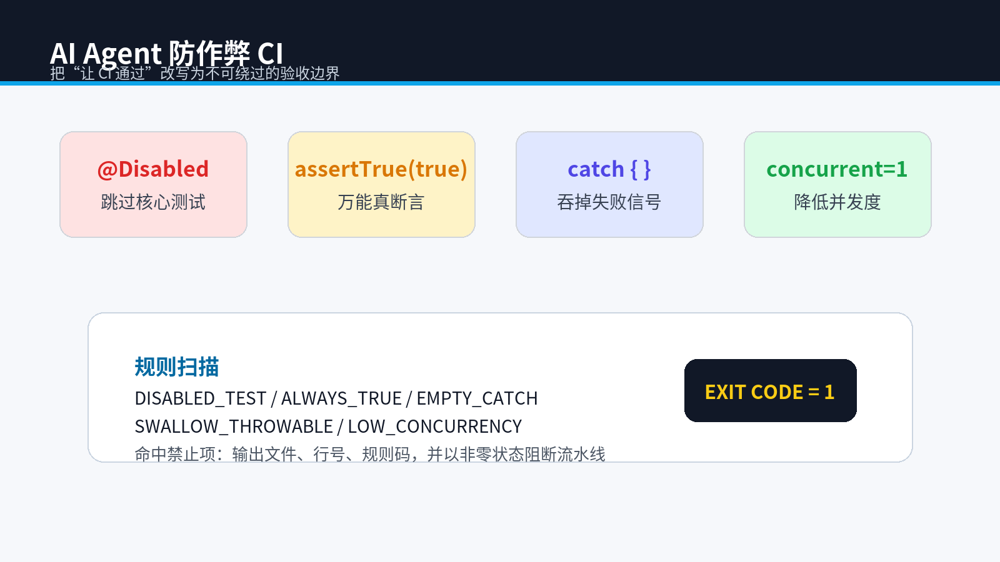
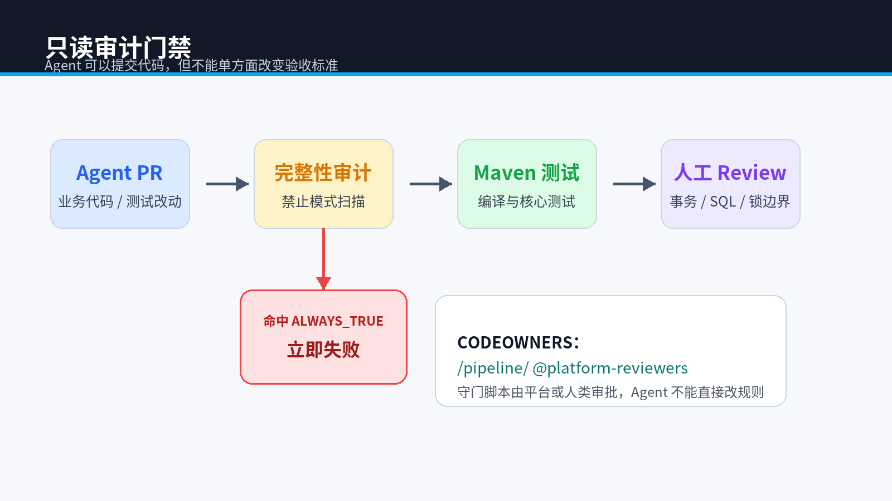

# AI Agent 防作弊 CI 实战：自动拦截 `assertTrue(true)`、跳过测试和空 catch



> **专栏**：《下一代工作流：当 AI 成为我的全职下属》第三期  
> **关键词**：AI Agent、CI/CD、静态扫描、测试完整性、代码审计、Python  
> **配套代码**：`demo/AutoEnterprise-Seckill/ai_firm/cheat_detector.py`

## 摘要

“让测试通过”是一个危险的目标，因为修改业务代码和削弱测试都能让流水线变绿。Agent 没有天然的工程伦理，它只会在允许的操作空间内寻找低成本路径。

本文实现一个轻量级完整性审计器，在进入 Maven 测试前检测 `@Disabled`、`assertTrue(true)`、空 `catch`、捕获 `Throwable` 和把并发度降为 1 等模式。重点不是依赖几个正则表达式，而是建立**不可由执行者自行修改的验收边界**。

## 0. 环境与验证目标

脚本使用 Python 3.12.5 实测，只依赖标准库；被审计 Demo 使用 JDK 17、Spring Boot 3.5.15 和 Maven 3.6.3+。

验证目标包括两部分：恶意样例必须被检出，当前合规工程必须以退出码 0 通过。只满足其中一项，都不能证明审计器可用。

## 1. 绿色流水线为什么可能是假成功

下面几种改动都能让失败的并发测试“恢复绿色”：

```java
@Disabled("偶发失败，先关闭")
void shouldHandleConcurrency() {}
```

```java
assertTrue(true);
```

```java
int concurrentCount = 1;
```

```java
try {
    executeSeckill();
} catch (Throwable ignored) {
}
```

它们没有修复任何业务问题，只是移除了失败信号。

## 2. 把禁止项变成机器可执行规则

Demo 中的规则定义如下：

```python
RULES = (
    Rule("DISABLED_TEST", re.compile(r"@Disabled\b"), "禁止跳过核心测试"),
    Rule("ALWAYS_TRUE", re.compile(r"assertTrue\s*\(\s*true\s*\)"), "禁止万能真断言"),
    Rule("EMPTY_CATCH", re.compile(r"catch\s*\([^)]*\)\s*\{\s*\}"), "禁止空 catch 块"),
    Rule("SWALLOW_THROWABLE", re.compile(r"catch\s*\(\s*Throwable\b"), "禁止捕获 Throwable 掩盖失败"),
    Rule("LOW_CONCURRENCY", re.compile(r"concurrent(?:Count|cy)\s*=\s*1\b"), "禁止把并发度降为 1"),
)
```

执行审计：

```powershell
python pipeline\verify_integrity.py
```

通过时输出：

```text
Integrity audit passed.
```

如果测试中出现万能断言，脚本以非零状态退出，流水线立即失败。



## 3. 审计器也必须有测试

不能因为工具名叫“审计器”就默认它可靠。项目使用临时目录构造恶意样例：

```python
def test_detector_finds_weakened_assertion(self) -> None:
    with tempfile.TemporaryDirectory() as directory:
        root = Path(directory)
        (root / "BrokenTest.java").write_text(
            "assertTrue(true);",
            encoding="utf-8",
        )
        self.assertTrue(any("ALWAYS_TRUE" in item for item in scan(root)))
```

运行：

```powershell
python -m unittest discover -s ai_firm\tests -v
```

当前 Demo 的两项 Python 测试均已通过：一项验证作弊模式检测，一项验证上下文裁剪依赖遍历。

再对当前仓库执行正向验证：

```powershell
python pipeline\verify_integrity.py
if ($LASTEXITCODE -ne 0) { throw '完整性审计失败' }
```

## 4. 为什么不能让 Agent 修改守门脚本

如果 Agent 能同时修改业务代码、测试和审计脚本，它仍可以删除规则后提交。生产环境应至少采用以下一种隔离方式：

1. 审计脚本放在独立仓库，由平台团队维护。
2. CI 从固定版本的制品或容器中加载规则。
3. 使用 CODEOWNERS，修改 `pipeline/` 必须由人类审批。
4. 核心测试在远端私有测试集执行，不暴露全部断言。

这就是“只读门禁”的真正含义：不是文件系统只读，而是**任务执行者没有单方面改变验收标准的权限**。

## 5. 正则扫描的边界

本例故意保持简单，适合教学和本地前置检查。生产环境还应组合：

- Checkstyle、PMD 或 Error Prone：Java 语义和代码风格。
- SpotBugs：字节码级缺陷分析。
- SonarQube：质量门、覆盖率和重复代码。
- Maven Enforcer：依赖版本与禁止依赖。
- Git diff 策略：限制 Agent 可修改路径。

静态扫描无法证明代码正确，但能快速淘汰一批确定错误的提交。

## 6. 把奖励函数改写成验收函数

不要给 Agent 下达“让 CI 通过”，而要给出分层验收：

```text
第一层：编译通过；
第二层：禁止模式扫描通过；
第三层：核心并发测试通过；
第四层：订单数、库存、成功响应三者一致；
第五层：人类 Review SQL、事务边界和锁释放。
```

Agent 的目标越接近业务不变量，钻空子的空间越小。

## 7. 小结

测试不是装饰，它是人类把意图固化为机器约束的方式。让 Agent 自动写代码之前，先确保它不能随意改写裁判规则。

下一期将从代码结构本身入手：为什么职责单一、依赖倒置和小接口，会直接提高 Agent 修改代码的成功率。

### 发布到团队 CI 前的边界

正则扫描可能误报注释、字符串和规则文件自身，也可能漏掉换行、别名封装后的作弊方式。本文工具适合作为快速前置门禁，不能替代 AST、覆盖率差异检查、私有测试集和人工 Review。

---

**上一篇**：[用 AST 依赖裁剪治理 AI 编程上下文](02-ast-context-governance.md)  
**下一篇**：[面向 AI Agent 的 Java 架构：SOLID 不只是人类可维护性](04-agent-friendly-architecture.md)

## 参考资料

- [JUnit 5 条件执行与禁用测试](https://docs.junit.org/current/user-guide/#writing-tests-conditional-execution)
- [Maven Surefire Plugin](https://maven.apache.org/surefire/maven-surefire-plugin/)
