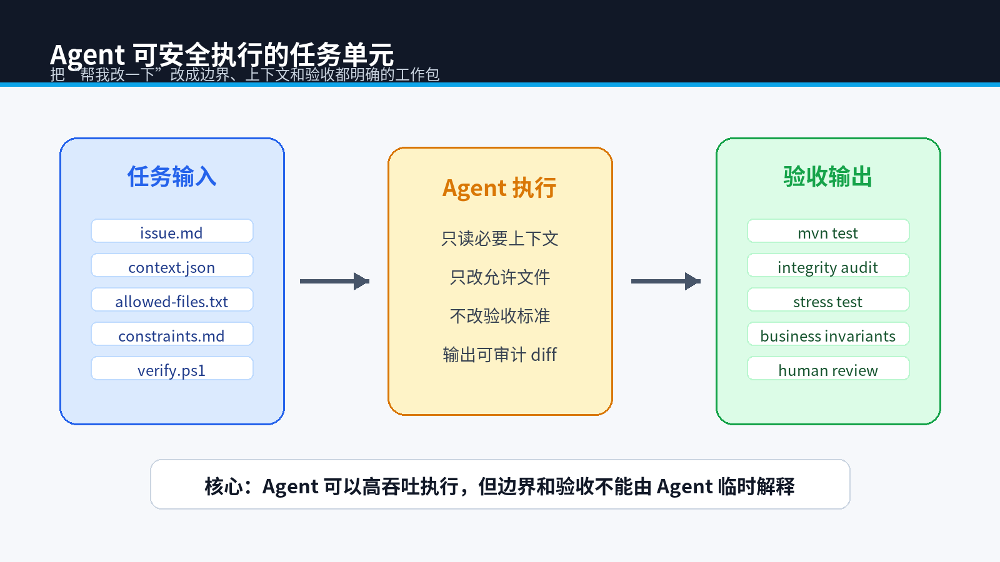
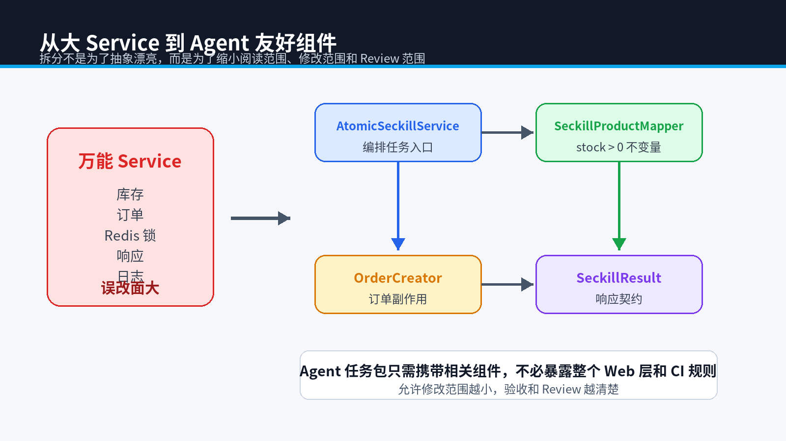

# 面向 AI Agent 的 Java 架构：用 SOLID、依赖倒置和小接口降低误改范围



> **专栏**：《下一代工作流：当 AI 成为我的全职下属》第四期  
> **关键词**：SOLID、Spring Boot、依赖倒置、模块化、AI 编程、Java 架构  
> **配套代码**：`demo/AutoEnterprise-Seckill/src/main/java/com/xiaoz/seckill/service`

## 摘要

同一个 Agent，在职责混杂的千行 Service 中容易误改，在边界清晰的小组件中却能稳定完成任务。原因不是模型突然变聪明，而是架构减少了它必须同时理解的状态、依赖和副作用。

本文以秒杀 Demo 的重构为例，将库存扣减、订单创建和分布式锁拆成独立职责，说明 SOLID 原则在 Agent 时代的新价值：它不仅降低人类维护成本，也让上下文可以被精准裁剪，让修改的影响范围可以被测试覆盖。

## 0. 环境与本文验证范围

示例已在 JDK 17.0.15、Spring Boot 3.5.15、MyBatis-Plus 3.5.15 下通过 Maven 测试。Redisson 代码基于 4.5.0 API 编译通过；由于本文运行环境未安装 Redis，分布式锁的网络行为未在本轮实测，读者需要按第 3 节启动 Redis 后验证。

## 1. 大 Service 对 Agent 有什么额外伤害

典型的“万能秒杀 Service”可能同时负责：

- 参数校验和用户身份解析。
- 查询商品、扣库存、创建订单。
- 获取 Redis 锁和处理重试。
- 记录埋点、发送消息、降级补偿。

人类可以凭经验跳读，Agent 却需要把这些分支都放进上下文。任何一个隐藏副作用都可能在修改时被破坏。

## 2. Demo 的职责拆分

当前工程把核心逻辑拆成四个角色：

| 组件 | 职责 |
| --- | --- |
| `AtomicSeckillService` | 编排原子扣减与订单创建 |
| `OrderCreator` | 只负责构造和保存订单 |
| `SeckillProductMapper` | 提供库存条件更新能力 |
| `RedissonSeckillService` | 负责锁边界和释放 |

`AtomicSeckillService` 的完整业务逻辑只有几行：

```java
@Transactional
public SeckillResult execute(Long userId, Long productId) {
    if (productMapper.deductStockIfAvailable(productId) != 1) {
        return SeckillResult.soldOut("atomic");
    }
    SeckillOrder order = orderCreator.create(userId, productId, "atomic");
    return SeckillResult.success(order.getId(), "atomic");
}
```

当 Agent 接到“修改库存策略”的任务时，上下文裁剪器只需提供 4 个文件、3427 个字符，不需要把整个 Web 层放进去。



## 3. 分布式锁应该包住什么

Redisson 模式只负责获取锁、调用原子业务、在 `finally` 中释放当前线程持有的锁：

```java
RLock lock = redisson.getLock("seckill:product:" + productId);
boolean acquired = false;
try {
    acquired = lock.tryLock(500, TimeUnit.MILLISECONDS);
    if (!acquired) {
        return busy();
    }
    return atomicSeckillService.execute(userId, productId);
} finally {
    if (acquired && lock.isHeldByCurrentThread()) {
        lock.unlock();
    }
}
```

这里仍保留数据库 `stock > 0` 条件更新。原因是锁与数据库约束解决的问题不同：

- 锁降低同一资源的并发冲突。
- 数据库条件更新守住最终库存不变量。

只依赖 Redis 锁，一旦锁配置、网络或调用路径出现问题，数据库就失去最后防线。

### 3.1 启用并验证 Redisson 模式

先将可访问的 Redis URI 与应用基础地址写入环境变量，再执行：

```powershell
$env:REDIS_ADDRESS='<Redis URI>'
$env:SECKILL_BASE_URL='<应用基础地址>'
mvn.cmd spring-boot:run "-Dspring-boot.run.profiles=redis"
python pipeline\run_stress_test.py --base-url $env:SECKILL_BASE_URL --mode redisson --concurrency 100 --requests 500 --stock 100
```

预期 `database_orders` 不超过 100、`remaining_stock` 不小于 0、`oversold` 为 `false`。如果 Redis 不可用，接口应返回 HTTP 503，而不是静默降级为无锁执行。

## 4. SOLID 如何转化为 Agent 友好性

### 4.1 单一职责：缩短必须理解的上下文

一个类只处理一个变化原因，Agent 修改时就不必同时推理订单、库存、消息和锁。

### 4.2 开闭原则：新增策略而不是覆盖旧逻辑

Demo 保留 `unsafe`、`atomic`、`redisson` 三条路径。读者可以对比行为，Agent 也不需要为了实现新策略删除旧案例。

### 4.3 依赖倒置：让测试替换基础设施

业务编排依赖 Mapper 和小组件，而不是在方法中自行创建连接、客户端和线程池。测试可以注入替代实现，生产配置也能独立变化。

### 4.4 接口隔离：避免给 Agent 过大的操作面

如果一个工具只需要扣库存，就不应同时暴露删除商品、批量改价等接口。对 Agent 而言，接口越大，可误用的能力越多。

## 5. 不要为了“解耦”制造过度抽象

Agent 友好不等于每三行代码创建一个接口。判断是否需要抽象，可以问三个问题：

1. 这个职责是否有独立变化原因？
2. 是否存在第二种实现或测试替身？
3. 抽象后是否明显缩小任务上下文？

如果三个答案都是“否”，保留直接代码通常更清晰。

## 6. 可量化的架构检查

可在 CI 中加入这些约束：

- Service 构造依赖数量不超过约定阈值。
- Controller 不直接访问 Mapper。
- 领域 Service 不依赖 Web 包。
- 单个任务允许修改的模块和路径明确列出。
- 核心组件具有独立测试和失败场景。

这些指标不是绝对真理，但能把“结构清晰”从口号变成可持续检查。

## 7. 小结

AI 时代没有让架构失效，反而放大了架构质量的收益。模块越清晰，Agent 需要的上下文越少；边界越稳定，自动生成代码的风险越可控。

最后一期将把前四期组合为一套 Human-in-the-loop 工作流：哪些步骤交给 Agent，哪些门禁必须由人类和自动化系统掌握。

### 适用边界与回退

- 单机应用优先考虑数据库原子更新，不要为了“分布式”强行引入 Redis。
- Redis 锁不可用时应失败或进入经过设计的降级路径，不能自动切换到 `unsafe`。
- Redisson Watchdog、等待时间和连接池参数需要结合业务耗时压测，Demo 参数不能直接复制到生产。

---

**上一篇**：[AI Agent 防作弊 CI 实战](03-agent-cheat-detection.md)  
**下一篇**：[Human-in-the-loop 终局：AI 研发工作流的五道生产门禁](05-human-in-the-loop-playbook.md)

## 参考资料

- [Redisson Locks and Synchronizers](https://redisson.pro/docs/data-and-services/locks-and-synchronizers/)
- [Redisson Spring Integration](https://redisson.pro/docs/integration-with-spring/)
- [Spring Boot System Requirements](https://docs.spring.io/spring-boot/system-requirements.html)
