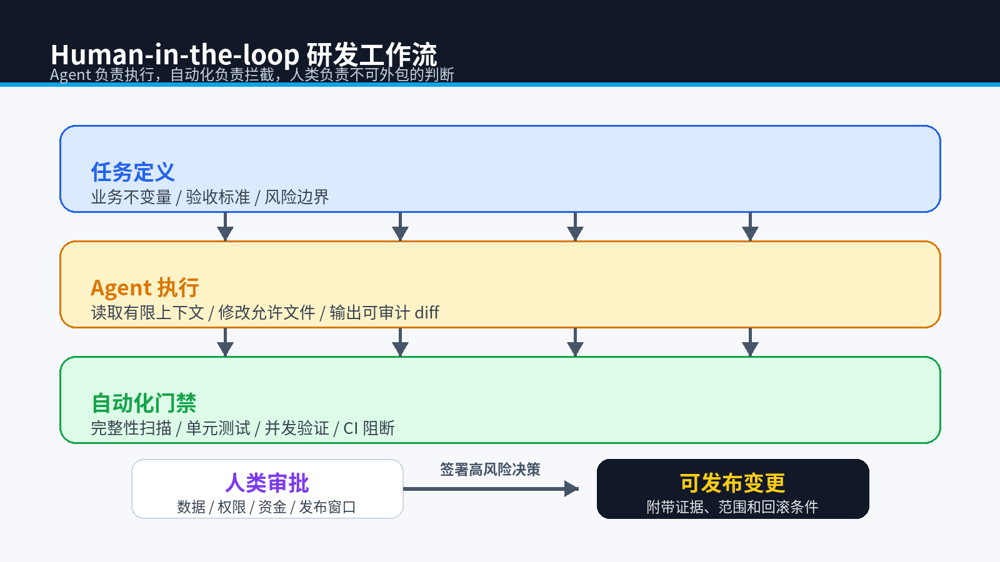
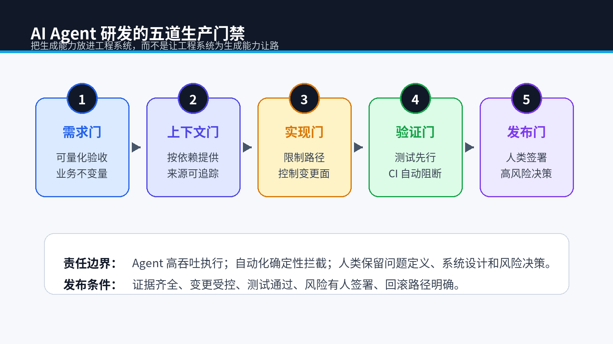

# Human-in-the-loop 实战：AI Agent 研发工作流的五道生产门禁



> **专栏**：《下一代工作流：当 AI 成为我的全职下属》第五期  
> **关键词**：Human-in-the-loop、AI Agent、软件工程、代码审查、CI/CD、研发效能  
> **配套代码**：`demo/AutoEnterprise-Seckill`

## 摘要

AI Agent 可以读取 Issue、修改代码、运行测试并生成提交，但“能执行完整流程”不代表“应该拥有最终发布权”。当代码生成成本下降，工程师的核心工作会向问题定义、上下文治理、自动化审计和风险签字迁移。

本文把前四期的秒杀事故、上下文裁剪、防作弊审计和模块化架构组合成一条可落地的 Human-in-the-loop 流水线，并给出团队可以直接采用的任务模板和发布检查清单。

## 0. 适用对象与验证环境

本文面向正在把代码 Agent 接入 Java 团队的技术负责人和高级开发者。配套 Demo 已在 2026-06-15 使用 JDK 17.0.15、Spring Boot 3.5.15、MyBatis-Plus 3.5.15、Python 3.12.5 完成 Maven 与 Python 测试；Redis 门禁属于可选路径，本轮未做网络实测。

## 1. 一条可靠的 AI 研发链路

推荐把流程拆成五道门：

```text
需求门 -> 上下文门 -> 实现门 -> 验证门 -> 发布门
```



### 第一门：需求必须可验证

错误写法：

```text
优化秒杀接口，注意高并发。
```

可执行写法：

```text
初始库存 100，300 个并发请求：
- 成功订单恰好 100；
- 最终库存为 0；
- 订单和库存事务一致；
- 禁止修改或跳过核心测试。
```

任务定义者需要把“业务正确”翻译成机器可判断的不变量。

### 第二门：上下文按依赖提供

使用 `context_pruner.py` 从目标类构建有限依赖包：

```powershell
python ai_firm\context_pruner.py `
  --target src\main\java\com\xiaoz\seckill\service\AtomicSeckillService.java `
  --output reports\context.json
```

上下文包应记录来源、选择原因和文件哈希。不要允许 Agent 自行遍历所有敏感配置和历史资料。

### 第三门：限制可修改范围

Developer Agent 只允许修改 `src/main/java`，QA Agent 只允许增加测试，二者都不能修改 `pipeline`。Demo 中的人设配置直接记录允许和禁止路径：

```json
{
  "role": "Developer Agent",
  "allowed_paths": ["src/main/java"],
  "forbidden_paths": ["src/test", "pipeline"]
}
```

### 第四门：自动化验证先于人工 Review

建议顺序：

```powershell
python pipeline\verify_integrity.py
python -m unittest discover -s ai_firm\tests -v
mvn.cmd test
```

自动化先过滤明显违规、编译错误和并发不变量失败。人类不应把时间浪费在机器可以确定拒绝的提交上。

### 第五门：人类签署高风险决策

以下内容不应只由 Agent 决定：

- 数据库迁移和不可逆数据操作。
- 认证、支付、资金和隐私逻辑。
- 新增外部依赖和许可证风险。
- 生产环境配置、权限和发布窗口。
- 性能数据的解释与容量承诺。

## 2. Demo 中的完整工作流

运行本地“AI 公司”编排器：

```powershell
python ai_firm\start_firm.py --issue issue.txt
```

它会读取 Issue、构建上下文、执行完整性扫描，并生成报告：

```json
{
  "context_file_count": 4,
  "context_character_count": 3427,
  "integrity_passed": true,
  "next_action": "review implementation and run mvn test"
}
```

这个脚本没有调用商业大模型 API，因此可以离线运行。生产环境可以在“生成上下文”和“完整性审计”之间接入任意 Agent 平台，但两侧门禁不应随模型供应商变化。

### 2.1 最小闭环验证

```powershell
python pipeline\verify_integrity.py
python -m unittest discover -s ai_firm\tests -v
mvn.cmd test
```

本轮验证结果：Python 2 项测试通过；Maven 1 项并发测试通过；300 个请求争抢 100 件库存时，成功订单恰好 100、最终库存为 0。这个结果证明 Demo 的原子模式守住了当前测试定义的不变量，但不等价于生产容量认证。

## 3. 四类常见翻车及对应防线

| 翻车类型 | 典型表现 | 防线 |
| --- | --- | --- |
| 幽灵依赖 | 引入不存在或不必要的包 | Maven Enforcer、依赖白名单、许可证扫描 |
| 虚假成功 | 吞异常、返回空对象 | 禁止空 catch、错误指标、失败注入 |
| 测试作弊 | 跳过测试、万能断言 | 只读测试集、静态审计、CODEOWNERS |
| 范围蔓延 | 修 A 时顺手改 B | 路径权限、上下文裁剪、变更行数阈值 |

## 4. 团队任务模板

```markdown
# 任务目标
一句话说明要改变的业务结果。

# 允许修改
- src/main/java/com/example/order/**

# 禁止修改
- pipeline/**
- src/test/resources/contracts/**

# 输入上下文
- 目标文件及依赖清单
- 接口契约
- 数据库约束

# 验收标准
- 功能断言
- 并发/性能边界
- 回滚条件

# 人工审批点
- 数据库迁移
- 新增依赖
- 生产发布
```

## 5. 工程师的价值发生了什么变化

当生成一段代码越来越便宜，价值不会消失，而会迁移到以下能力：

1. **定义问题**：识别真正的业务约束，而不是只描述界面或方法名。
2. **组织上下文**：给 Agent 足够证据，同时排除噪声和敏感信息。
3. **设计边界**：让模块、权限和事务范围可以独立验证。
4. **构建审计**：把经验写成测试、规则和流水线。
5. **承担决策责任**：对上线风险、数据影响和商业后果签字。

## 6. 最终检查清单

在接受 Agent 提交前逐项确认：

- [ ] Issue 包含量化验收条件。
- [ ] 上下文来源可追踪，没有无关敏感文件。
- [ ] 变更未越过允许路径。
- [ ] 没有跳过测试、万能断言和吞异常。
- [ ] 核心业务不变量有并发测试。
- [ ] 新依赖经过版本、漏洞和许可证检查。
- [ ] 性能数字来自当前版本的真实环境。
- [ ] 高风险变更有人类审批和回滚方案。

## 7. 专栏结语

这五期从一段会超卖的事务代码开始，最终形成了一条可执行的研发链路。结论不是“AI 会取代工程师”，也不是“AI 不可靠所以不能使用”，而是：

> **把 Agent 当作高吞吐但需要边界的执行者；把人类留在问题定义、系统设计和风险决策的位置。**

代码会越来越便宜，可靠性不会。真正的下一代工作流，是让生成能力进入工程体系，而不是让工程体系为生成能力让路。

### 落地限制

- 路径白名单需要由实际执行平台强制，JSON 配置本身不具备权限隔离能力。
- 私有代码发送到外部模型前必须完成数据分级、脱敏和供应商合规评估。
- 自动门禁只能减少已知风险，生产发布仍需要监控、灰度、回滚和责任人确认。

---

**上一篇**：[面向 AI Agent 的 Java 架构](04-agent-friendly-architecture.md)  
**系列起点**：[Spring Boot 高并发秒杀：AI Agent 的第一次超卖事故](01-agent-overselling-incident.md)

## 参考资料

- [Spring Boot 官方文档](https://docs.spring.io/spring-boot/documentation.html)
- [Redisson 锁与同步器](https://redisson.pro/docs/data-and-services/locks-and-synchronizers/)
- [MyBatis-Plus Spring Boot 3 安装说明](https://baomidou.com/getting-started/install/)
