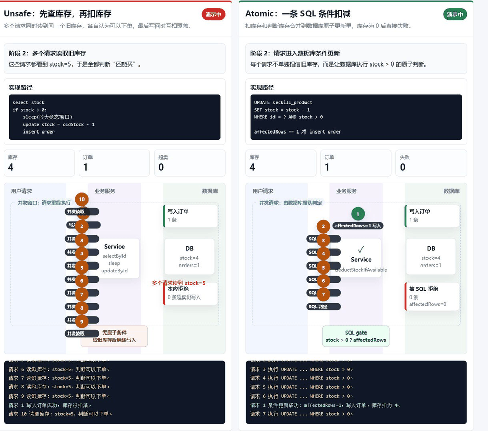

# AutoEnterprise-Seckill

用于《当 AI 成为我的全职下属》专栏的可运行工程靶场。

## 能力矩阵

| 模式 | 端点 | 用途 | 外部依赖 |
| --- | --- | --- | --- |
| unsafe | `/api/seckill/unsafe` | 演示先查后改的竞态窗口 | 无 |
| atomic | `/api/seckill/atomic` | 演示数据库条件更新 | 无 |
| redisson | `/api/seckill/redisson` | 演示分布式锁与二次校验 | Redis |

## 环境

- JDK 17+
- Maven 3.6.3+
- Python 3.11+（压测和 AI 工程脚本）
- Redis 6+（仅 Redisson 模式）

## 启动

本 Demo 不在代码里写死应用端口、服务地址或 Redis 地址。公开仓库只保留 `.env.example`，真实配置写在本机 `.env`，该文件已被 `.gitignore` 忽略，不应上传 GitHub。

| 变量 | 是否必填 | 代表什么 | 如何填写 |
| --- | --- | --- | --- |
| `SERVER_PORT` | 是 | Spring Boot 应用监听端口 | 填一个当前机器可用端口，例如你决定使用的 Web 服务端口 |
| `SECKILL_BASE_URL` | 压测时必填 | 压测脚本访问应用的基础地址 | 按 `http://<应用主机>:<SERVER_PORT>` 填写；远程部署时使用实际可访问地址 |
| `REDIS_ADDRESS` | 仅 Redisson 模式必填 | Redisson 连接 Redis 的地址 | 单机 Redis 使用 `redis://<Redis主机>:<Redis端口>`；TLS 连接使用 `rediss://<Redis主机>:<Redis端口>` |
| `REDIS_PASSWORD` | Redis 有密码时填写 | Redis 认证密码 | 只在目标 Redis 开启密码认证时设置 |

首次运行时，先复制示例配置并改成自己的环境值：

```powershell
Copy-Item .env.example .env
notepad .env
. .\scripts\load-env.ps1
```

基础模式不依赖 Redis。Spring Boot 会自动读取当前目录下的 `.env`；上面的 `load-env.ps1` 只负责把 `.env` 加载到当前 PowerShell，方便后续手工调用接口：

```powershell
mvn.cmd test
mvn.cmd spring-boot:run
```

命令要求当前终端中的 `java -version` 已指向 JDK 17 或更高版本。应用使用内存 H2，重启后数据会重置。

## Redis 模式

Redisson 模式需要提供 Redis 地址，并使用 `redis` Profile 启动：

```powershell
mvn.cmd spring-boot:run "-Dspring-boot.run.profiles=redis"
```

## AI 工程脚本

```powershell
python ai_firm\context_pruner.py --target src\main\java\com\xiaoz\seckill\service\AtomicSeckillService.java
python ai_firm\cheat_detector.py --root .
python ai_firm\start_firm.py --issue issue.txt
```

## 动画演示

如果想直接观察并发过程，可以用浏览器打开：

```text
visualization/seckill-animation.html
```

如果博客平台不支持内嵌 HTML/JS，可以直接使用动图：

```markdown

```

这个页面不依赖后端服务，会用动画同时演示：

- `unsafe`：多个请求同时读到旧库存，随后都创建订单，最终订单数超过库存。
- `atomic`：请求通过数据库条件更新扣减库存，库存为 0 后后续请求失败，不会超卖。

如果该仓库已启用 GitHub Pages，也可以尝试用 iframe 内嵌完整交互页面：

```html
<iframe
  src="https://quan020406.github.io/xiaozhan-blog-column-demos/下一代工作流-当AI成为我的全职下属/demo/AutoEnterprise-Seckill/visualization/seckill-animation.html"
  width="100%"
  height="760"
  frameborder="0">
</iframe>
```

## 压测

本 Demo 提供两个 Python 测试脚本：

| 脚本 | 是否需要启动后端 | 主要用途 | 适合什么时候用 |
| --- | --- | --- | --- |
| `pipeline/run_stress_test.py` | 需要 | 向秒杀接口发起并发 HTTP 请求，观察是否超卖 | 验证 `unsafe`、`atomic`、`redisson` 三种实现的运行效果 |
| `pipeline/verify_integrity.py` | 不需要 | 静态扫描代码，检查测试作弊、空 catch、跳过测试等危险模式 | 提交前做工程治理和完整性检查 |

### `run_stress_test.py`

压测脚本会自动读取当前目录下的 `.env`。`SECKILL_BASE_URL` 只给压测脚本使用，不会改变应用监听端口。运行该脚本前，需要先启动 Spring Boot 应用：

```powershell
mvn.cmd spring-boot:run
```

常用命令：

```powershell
python pipeline\run_stress_test.py --mode unsafe --concurrency 100 --requests 500 --stock 100
python pipeline\run_stress_test.py --mode atomic --concurrency 100 --requests 500 --stock 100
```

参数含义：

| 参数 | 默认值 | 含义 |
| --- | --- | --- |
| `--base-url` | 读取 `.env` 中的 `SECKILL_BASE_URL` | 秒杀应用的基础访问地址，例如 `http://<应用主机>:<SERVER_PORT>` |
| `--mode` | `atomic` | 压测模式，可选 `unsafe`、`atomic`、`redisson`，分别对应三个秒杀接口 |
| `--concurrency` | `100` | 并发线程数，表示同一时间最多有多少个请求一起打到接口 |
| `--requests` | `500` | 总请求数，脚本会生成从 `1` 到该值的 `userId` |
| `--stock` | `100` | 每轮压测开始前重置的初始库存 |

终端输出示例：

```json
{
  "mode": "atomic",
  "requests": 500,
  "concurrency": 100,
  "initial_stock": 100,
  "success_responses": 100,
  "database_orders": 100,
  "remaining_stock": 0,
  "elapsed_seconds": 0.258,
  "requests_per_second": 1940.43,
  "errors": 0,
  "oversold": false
}
```

输出字段含义：

| 字段 | 含义 | 怎么判断 |
| --- | --- | --- |
| `mode` | 本次压测的秒杀模式 | 对应 `--mode` |
| `requests` | 本次发出的总请求数 | 对应 `--requests` |
| `concurrency` | 本次使用的并发线程数 | 对应 `--concurrency` |
| `initial_stock` | 压测开始前重置的库存 | 对应 `--stock` |
| `success_responses` | 接口返回 `success=true` 的次数 | 表示客户端看到多少次抢购成功 |
| `database_orders` | 压测结束后数据库里的订单数 | 这是最终落库结果，比接口返回更适合判断真实后果 |
| `remaining_stock` | 压测结束后的剩余库存 | 正常情况下应与订单数互相匹配 |
| `elapsed_seconds` | 发完所有请求耗费的秒数 | 用于粗略观察耗时 |
| `requests_per_second` | 每秒处理请求数 | 由 `requests / elapsed_seconds` 计算得出 |
| `errors` | 请求异常数量 | 网络错误、超时、JSON 解析失败会计入这里 |
| `oversold` | 是否超卖 | 当 `database_orders > initial_stock` 时为 `true` |

典型结论：

- `unsafe` 如果出现 `database_orders` 大于 `initial_stock`，并且 `oversold` 为 `true`，说明先查后改在并发下发生超卖。
- `atomic` 正常情况下 `database_orders` 不会超过 `initial_stock`，`remaining_stock` 会扣到 `0`，`oversold` 为 `false`。
- `redisson` 需要先用 Redis Profile 启动应用，否则会返回 Redis 不可用相关错误。

### `verify_integrity.py`

完整性检查脚本不访问 HTTP 接口，也不需要启动 Spring Boot。它会复用 `ai_firm/cheat_detector.py` 的扫描规则，检查当前工程里是否出现明显不可信的测试或异常处理写法。

运行命令：

```powershell
python pipeline\verify_integrity.py
```

正常输出：

```text
Integrity audit passed.
```

这表示没有扫描到脚本内置规则禁止的危险模式。

如果检查失败，终端会输出命中的文件和规则，并以非 0 状态码退出。此时应先修复对应代码，再重新运行检查。
